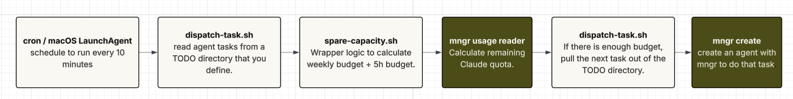

Even though you pay every month for your Claude plan, your quota is actually based on 1) a 5-hour window that opens on your first prompt and resets five hours later, and 2) a weekly window.

The budget _doesn't roll over!_ You've already paid for it, but that capacity simply evaporates when the current session's 5 hour window is up.

- **40%** of a typical day's 5-hour Claude quota expires.
- **12,000** lines of working code that idle capacity could write every week.

<figure class="ev-figure"><svg class="ev-blob" viewBox="-100 -100 200 200" aria-hidden="true"><path fill="#8ba2b4" d="M95,0C92.07,19.17 57.08,31.67 37.8,46.6C18.52,61.53 -6.17,93.35 -20.7,89.6C-35.23,85.85 -39.37,45.62 -49.4,24.1C-59.43,2.58 -86.95,-26.07 -80.9,-39.5C-74.85,-52.93 -35.82,-51.68 -13.1,-56.5C9.62,-61.32 37.38,-77.82 55.4,-68.4C73.42,-58.98 97.93,-19.17 95,0Z"/></svg><figcaption>Ev, invertebrate observer</figcaption></figure>

Imbue engineer Ev used their quota to find and fix bad tests in the mngr codebase. In a day, they were able to 
produced 9 merged PRs that added [integration tests](https://github.com/imbue-ai/mngr/pull/1980/changes/85dc9e9ed3debd89180c1cf8beec51042296db1a), fixed [silently failing tests](https://github.com/imbue-ai/mngr/pull/1895), and [cleaned up code](https://github.com/imbue-ai/mngr/pull/1973).


## How to use it

Ev's workflow and all of their code is checked into our [open source mngr repo](https://github.com/imbue-ai/mngr). 

### 1. Install mngr and the usage plugins

The default [install of mngr](https://imbue.com/product/mngr) doesn't include the usage plugin that monitors token usage. Add the plugin:

```
mngr plugin add imbue-mngr-usage imbue-mngr-claude-usage
```

### 2. Fork Ev's "fix bad tests" Claude skill, or write your own skill.

[Ev's skill](https://github.com/imbue-ai/mngr/blob/c72d8c39055d1acce27d0a072a836d2853271272/.claude/skills/identify-bad-tests/SKILL.md?plain=1#L4) lives in our open source mngr repo. Then, [add this custom skill to Claude.](https://support.claude.com/en/articles/12512180-use-skills-in-claude#h_a4222fa77b)

### 3. Trigger mngr to check quota every 10 minutes, and run skill if there's spare capacity.

Schedule [this script](https://github.com/imbue-ai/mngr/blob/c72d8c39055d1acce27d0a072a836d2853271272/libs/mngr_usage/docs/cron_recipes.md?plain=1#L165) every 10 minutes on cron or LaunchAgent on macOS. The script does two things:
1) Use `mngr usage` to check the remaining Claude quota
2) If there's quota, start the agent using `mngr create`.

This script define "budget to spare" as when the 5h window has <80% used budget *and* weekly usage is below a line that starts ~30% under the plain `used% = how_much_the_cycle_has_elapsed%` pace early in the rolling 7-day cycle and tapers up to meet it by the cycle's end.




## Why it's cool

CALLOUT: cool bc it shows the mngr workflow
like the whole integration into mngr
mngr can create agents, you can do custom things

Of course, you can customize your own script too!

customizability
abstraction
composable


## Under the hood - what mngr does

The whole thing rides on `mngr usage`, which is refreshingly low-tech. Writer plugins append one JSONL line per refresh to a conventional path (`events/<source>/usage/events.jsonl`) — each line a small `cost_snapshot` with a `session_id`, the rate-limit windows, and cost. `mngr usage` is a pure reader: it walks those files and aggregates, taking the **freshest reading** for rate-limit windows (they're an account-level counter, so you don't need a dedicated agent alive to keep the snapshot current) and grouping cost per session. Usage even survives `destroy` — events are preserved off to the side first — so a throwaway window-warmer still counts. [2]


## Donate your idle quota to science

Here's the part we're most excited about. You can donate your about-to-expire capacity to biomedical research. We've packaged a skill that points your idle Claude windows at [RaNA-seq](https://ranaseq.eu/), an open source tool to analyze gene transcription and expression - relevant to drug discovery and rare disease diagnostics!

Once your agent is set up in Claude, run it in one line:

```bash
mngr create donate-extra-quota-bio claude --no-connect \
  --message "Use the donate-to-bio-research skill"   # skill: [link placeholder]
```

Wire it to the same `use-extra.sh` schedule, and the extra quota goes to work on something that matters.

**We're also looking to sponsor other open source research project.** If you're a lab that could use the compute — reach out at [doinggood@imbue.com].

Next steps:
- [Read the launch post](https://imbue.com/blog/mngr)


